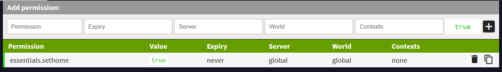

Zarządzanie Permisjami - LuckPerms
=====================

[Pobieranie pluginu LuckPerms](https://luckperms.net/)
----------------------------------------------------

Spis treści
-----------

* [Podstawy](#podstawy)
* [Zanim zaczniemy!](#zanim)
* [LP Editor oraz grupa Default](#default)
* [Forge](#nodes)
* [Sponge](#sponge)

<a name="podstawy"><h2>Podstawy</h2></a>

By chronić Twój serwer przed złośliwymi graczami. większość pluginów, które wgrywasz na swój serwer domyślnie udostępnia komendy jedynie operatorom (adminom). By umożliwić graczom korzystanie z tych komend pluginy oraz silniki Minecrafta obsługują systemy zarządzania dostępami (zwanymi częściej permisjami).

<h3>UWAGA!</h3>

Kluczowym jest by czytać dokumentacje i opisy pluginów, ponieważ niektóre komendy mogą spełniać **różne funkcje w zależności od permisji, które dany gracz posiada.**

<a name="zanim"><h2>Zanim zaczniemy!</h2></a>

Obecnie najpopularniejszym menedżerem permisji jest plugin LuckPerms. W przeciwieństwie do nierozwijanego już PermissionsEx, edycja uprawnień odbywa się z użyciem wbudowanego graficznego interfejsu, przez co jest intuicyjna. Co więcej, LuckPerms dostępny w wersjach na wszystkie najczęściej używane silniki obsługujące pluginy, dlatego będziemy na nim bazować w tym poradniku. **Aczkolwiek zasady nadawania i edycji permisji są uniwersalnie niezależnie od używanego menedżera.** Poszczególne pluginy zarządzania permisjami używają różnych edytorów - czy to własnego graficznego interfesju, czy też zwykłego notatnika tekstowego.

Dokumentację oraz sam plugin LuckPerms (LP) można znaleźć na [**tej stronie**](https://luckperms.net/).

<a name="default"><h2>LP Editor oraz grupa default</h2></a>

<h3>Edytor grup i permisji LuckPerms</h3>

Edycja permisji istniejących grup i użytkowników jest w LP bardzo prosta intuicyjna - wystarczy będąc opem wywołać komendę **/lp editor**, a plugin zwróci nam link do swojego graficznego edytora graficznego edytora:

Zakładki poprzedzone znaczkiem z literą **G** to grupy (group), a **U** to gracze (user). Pasek **Add permission** służy dodawaniu nowych permisji:

Jego poszczególne pola to kolejno:
* *Permisja* - tu wpisujemy odpowiednią permisję,
* *Data wygaśnięcia* - tu można wpisać kiedy permisja traci ważność,
* *Serwer* - jeśli nasz serwer to tak naprawdę sieć wielu serwerów, możemy tutaj wpisać, na którym z subserweró dana permisja ma obowiązywać,
* *Świat* - tu wpisujemy, na którym świecie obowiązuje dane uprawnienie (np. world, world_nether, world_the_end).
* *Opis* - dowolny tekst ułatwiający identyfikację permisji.
* *Wartość Logiczna* - ostatnią wartością jest **true** lub **false** - true nadaje uprawnienie, a false je odbiera.

**Uwaga! Najcześciej wystarczy wypełnić problem "Permission" oraz ustawić odpowiednią wartość logiczną (true).**

<h3>Grupa default</h3>

Przy pierwszym uruchomieniu serwera po zainstalowaniu menedżera permisji tworzona jest grupa **default**. Jest to grupa domyślna, do której przydzielany jest **każdy gracz** wchodzący na nasz serwer. Dlatego by udostępnić komendę wszystkim graczom, należy wpisać odpowiednią permisję do grupy **default**.

---

<h3>Przykład</h3>

Chcemy pozwolić każdemu graczowi na zaznaczenie domu za pomocą komendy **/sethome** z pluginu **Essentials**.

**Jak to zrobić?**

W dokumentacji Essentials znaleźliśmy, że odpowiednią permisją jest `essentials.sethome`. Gdy zaczniemy wpisywać ją w pole `Permission`, LP wyświetli nam podpowiedzi:

Po wpisaniu całości i upewnieniu się, że wartość logiczna to **true** klikamy plus. Dodane uprawnienie wygląda tak:

By zapisać zmiany należy kliknąć ikonę dyskietki:

I przekopiować wygenerowaną komendę na chat w grze:

---
<a name="nodes"><h2>Tworzenie nowych grup</h2></a>

TBF

<a name="sponge"><h2>Sponge</h2></a>

TBF
